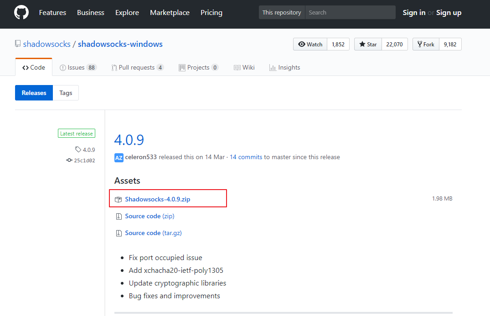
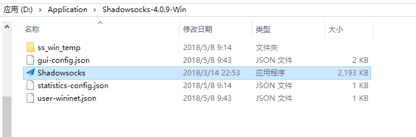
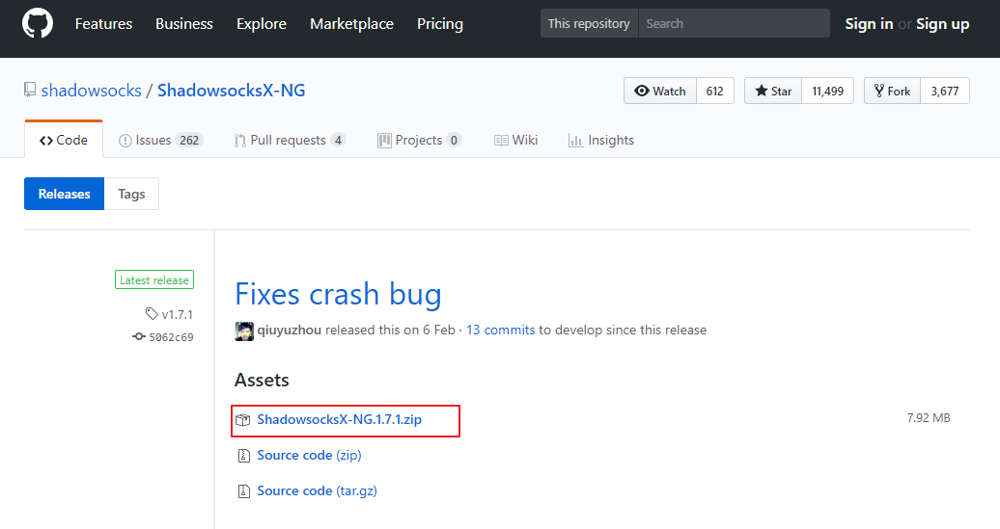
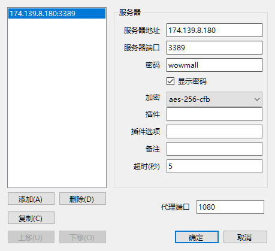
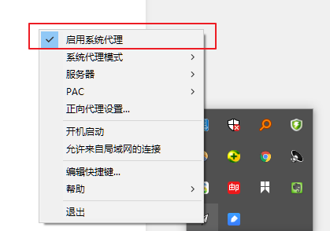

# shadowsocks 翻墙工具使用

## 第一步 安装

* 1. windows 系统

  1.1 下载 shadowsocks
  
  [下载地址传送门](https://github.com/shadowsocks/shadowsocks-windows/releases)

  1.2 下载后解压并运行 Shadowsocks.exe
  

* 2. MacOS 系统

1. 下载 shadowsocks
   
   [下载地址传送门](https://github.com/shadowsocks/ShadowsocksX-NG/releases)

2. 下载后解压安装

当然了如果你是 window 用户你可以直接使用我一下下载过的包，就在跟目录下的【Shadowsocks-4.0.9-Win.rar】

## 第二步 配置信息

1. 填写服务新
   

2. 启动全局代理
   

## 测试是否可用

可用等 Facebook 或者是直接 Google，如果能访问成功就说明安装成功了。
